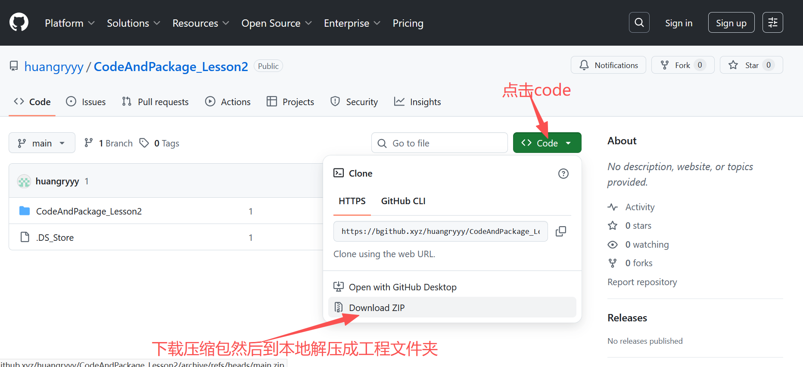

# 《人工智能系统设计与应用实践》课程代码

本仓库包含中山大学集成电路学院毛文东老师主讲的《人工智能系统设计与应用实践》课程配套代码。

## 课程代码

### 第一节课
[代码链接](https://github.com/huangryyy/LeNet-5-master_Lesson1)

### 第二节课
[代码链接](https://github.com/huangryyy/CodeAndPackage_Lesson2)

### 第三节课
[代码链接](https://github.com/huangryyy/Lesson3)

### 第四节课
[代码链接](https://github.com/huangryyy/LITNet_Lesson4/tree/main/LITNet_2026)

### 第五节课
[代码链接](https://github.com/MingfanZhao/Class-05-Artificial-Intelligence-Laboratory-Course)

### 第六节课
[代码链接](https://github.com/MingfanZhao/Class-06-Artificial-Intelligence-Laboratory-Course)

### 第七节课
[代码链接](https://github.com/MingfanZhao/Class-07-Artificial-Intelligence-Laboratory-Course)

## 说明

- 各节课代码已经上传
- 每节课文件夹内包含对应的示例代码和练习
- 建议按照课程顺序进行学习

## 使用方式

## 授课教师

毛文东老师（中山大学集成电路学院）

## 许可证

MIT License